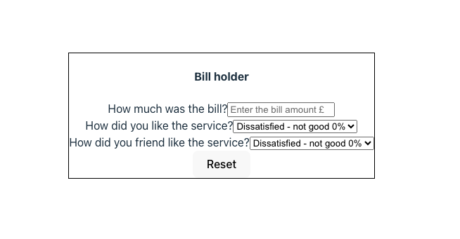

# React practice - core concepts challenge

## Table of Contents

- [Description](#Description)
- [Usage](#Usage)
- [Requirements mapping](#requirements-mapping)
- [Testing](#Testing)
- [Questions](#Questions)

## Description

This repo contains a very simple react bill calc application as part of the Jonas Schmedtmann REACT course.

The app takes a bill and calculates the tip amount based on 2 people rating the experience. Super simple concept. The underlying REACT code reaches across a number of REACT concepts.

### What problem does the project solve?

From a development perspective it combines all the basic REACT concepts and brings them together:

JSX & components
Props
Children Props
State
Lifting up state
Derived state
Controlled elements in forms

## Installation

This is not a published application - it is the source code to be run on a local server.

## Usage

Fork the code and run on a localhost.

You can see screenshots of the application here:

## Questions

There could be parts of the code that could be made more efficient and I could have separated out the You pay section and the reset button into separate components.

I also kept all my functions in the parent component and passed down as props.

To contact me directly, you can email me directly at: johnturnerdick@gmail.com

## **License**

This project is not covered by a license yet.

## Credits

This repo was created by John Dick as part of learning React.
